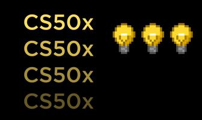
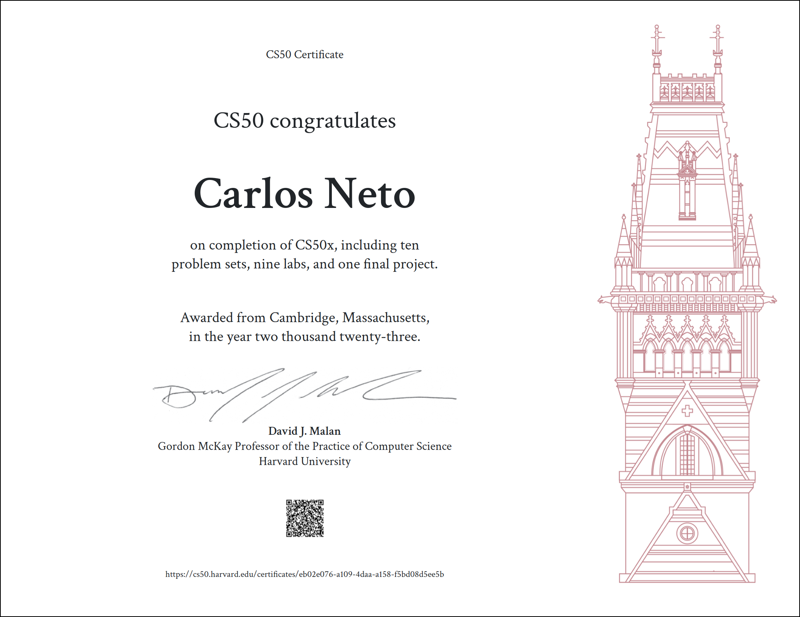

# CS50’s Introduction to Computer Science

Before reading the files in this repository, please remember the [Academic Honesty](https://cs50.harvard.edu/x/honesty/).\
These files serve to give you a sense of how to solve the problems **if** you feel lost.\
Do not copy and paste any of these files. Try to solve the problems yourself!

## Submissions

* **[C](week1)**
   - [Hello](week1/hello)
   - [Mario-More](week1/mario-more)
   - [Credit](week1/credit)
   
* **[Arrays](week2)**
   - [Readability](week2/readbility)
   - [Substitution](week2/substitution)
   - [Scrabble](week2/scrabble)
   
* **[Algorithms](week3)**
   - [Plurality](week3/pluralty)
   - [Tideman](week3/tideman)
   - [Sort](week3/sort)
   
* **[Memory](week4)**
   - [Filter-More](week4/filter-more)
   - [Recover](week4/recover)
   - [Volume](week4/volume)
   
* **[Data Structures](week5)**
   - [Speller](week5/speller)
   - [Inheritance](week5/inheritance)
   
* **[Python](week6)**
   - [Sentimental-Hello](week6/sentimental-hello)
   - [Sentimental-Mario-More](week6/sentimental-mario-more)
   - [Sentimental-Credit](week6/sentimental-credit)
   - [Sentimental-Readability](week6/sentimental-readability)
   - [DNA](week6/dna)
   - [World-Cup](week6/world-cup)
   
* **[SQL](week7)**
   - [Movies](week7/movies)
   - [Fiftyville](week7/fiftyville)
   - [Songs](week7/songs)
   
* **[HTML, CSS, JavaScript](week8)**
   - [Homepage](week8/homepage)
   - [Trivia](week8/trivia)
   
* **[Flask](week9)**
   - [Finance](week9/finance)
   - [Birthdays](week9/birthdays)

## Final Project

* [**Final Project**](final-project)

## Certificate

